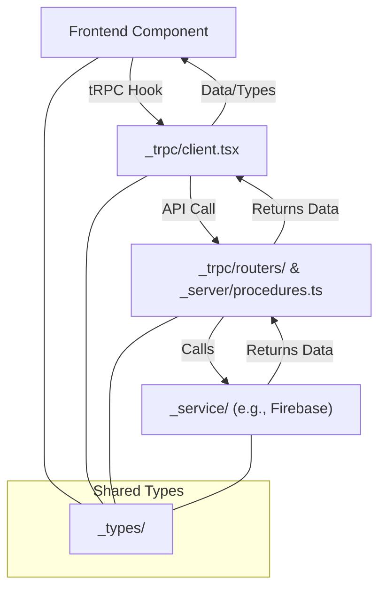

# Creata App Architecture

This document provides an overview of the architecture and structure of the `creata` folder, which powers the main features of the application. The architecture is modular, scalable, and leverages modern React, tRPC, and provider patterns for robust data handling and UI composition.

---

## 📁 Folder Structure Overview

-**\_component/**: Shared UI components (buttons, navigation, error boundaries, etc.)

-**\_provider/**: Context and data providers (e.g., React Query)

-**[\_repositories](#repositories-section "Click to move to the repositories section")/**: Feature modules, each with its own components, hooks, services, and styles

-**[\_server](#server "Click to move to the _server section")/**: Server-side procedures (e.g., tRPC endpoints)

-**[\_service](#service "Click to move to the _service section")/**: Service layer for external APIs and business logic

-**[\_trpc](#trpc "Click to move to the trpc section")/**: tRPC client/server setup and routers

-**[\_types](#types "Click to move to the types section")/**: TypeScript types and interfaces

-**\_utils/**: Utility functions and helpers

-**(account), (homepage), (slug), (user)**: Route groups for Next.js app directory routing

-**api/**: API route handlers (e.g., tRPC HTTP endpoints)

-**layout.tsx**: Root layout wrapper for the app

---

## 🗄️ Data Handling

-**Service Layer (`_service/`)**:

Handles all data fetching and business logic, such as Firebase interactions and REST calls.

Example:

-`firebase_private_creata_service.ts`

-`firebase_public_creata_service.ts`

-**Repositories (`_repositories/`)**:

Each feature (e.g., `award-winning-2024`, `doodle-meme-carousel`) encapsulates its own:

- Components
- Hooks (for data fetching/caching)
- Server procedures
- Service functions
- Styles

-**Hooks**:

Custom hooks (e.g., `use-prefetch-video-blob.ts`) are colocated with their feature for encapsulated data logic.

---

## 🔌 tRPC Integration

-**\_trpc/**:

-`client.tsx`, `server.tsx`: tRPC client/server setup for type-safe API calls.

-`routers/`: tRPC routers for modular API endpoints.

-`init.ts`, `query-client.ts`: Initialization and query client setup.

-**\_server/procedures.ts**:

Defines server-side procedures that can be called via tRPC.

-**api/trpc/[trpc]/route.ts**:

Next.js API route for tRPC HTTP requests.

---

## 🖼️ Frontend & UI

-**\_component/**:

Shared UI components used across the app (e.g., `create-button.tsx`, `navigation-bar.tsx`).

-**\_repositories/**:

Feature-specific UI components and pages.

-**(account), (homepage), (slug), (user)**:

Next.js route groups for organizing pages and layouts by feature or user context.

-**\_provider/query-provider.tsx**:

Provides React Query context for data fetching and caching.

---

## 🗂️ Layout Wrapper

-**layout.tsx**:

The root layout file wraps the entire application, providing global providers, navigation, and consistent styling.

-**Nested Layouts**:

Each route group (e.g., `(account)/account/layout.tsx`) can define its own layout for feature-specific wrappers.

---

## 📝 Type Safety

-**\_types/**:

Centralized TypeScript types for accounts, errors, homepage data, and tRPC.

---

## 🛠️ Utilities

-**\_utils/**:

Utility functions for error handling, component registries, and other helpers.

---

## 🧩 Extending the App

- To add a new feature:

1. Create a new folder in `_repositories/` with its own `components/`, `hooks/`, `service/`, etc.
2. Add tRPC procedures in `_server/` and register them in `_trpc/routers/`.
3. Add UI components to `_component/` if they are shared.
4. Use providers from `_provider/` for state and data management.

---

## 📚 Example Data Flow

1.**UI Component** (e.g., in `_repositories/award-winning-2024/components/`)

⬇️

2.**Custom Hook** (e.g., `use-prefetch-video-blob.ts`)

⬇️

3.**Service Function** (e.g., `get-videos-url.ts`)

⬇️

4.**tRPC Procedure** (optional, for server-side logic)

⬇️

5.**API Route** (e.g., `api/trpc/[trpc]/route.ts`)

---

## 🏗️ Summary

-**Modular**: Each feature is self-contained.

-**Type-Safe**: End-to-end types with TypeScript and tRPC.

-**Scalable**: Easy to add new features, APIs, and UI components.

-**Modern**: Uses Next.js app directory, React Query, and tRPC for best practices.

---

For more details, see the code in each respective folder.

---

## 🧩 `_repositories` Folder: Feature Modules

The `_repositories` folder organizes the main **feature modules** of the Creata app. Each subfolder represents a self-contained UI feature or micro-app, following a modular structure that encapsulates all logic, configuration, and presentation for that feature.

### Structure of a Feature Repository

Each feature (e.g., `award-winning-2024`, `doodle-meme-carousel`, `counter`) typically contains:

-**Main Component**

The entry point React component for the feature (e.g., `award-winning-2024-component.tsx`, `doodle-meme-component.tsx`, `counter.tsx`).

-**components/**

Smaller, reusable UI components specific to the feature (e.g., `fade-in-out-wrapper.tsx`, `glitch-text.tsx`, `videos-display.tsx`).

-**hooks/**

Custom React hooks for encapsulating data fetching, state, or side effects (e.g., `use-prefetch-video-blob.ts`, `use-doodle-meme-videos.tsx`).

-**service/**

Service functions for data access, API calls, or business logic (e.g., `get-videos-url.ts`, `doodle-meme-videos.ts`).

-**server/**

Server-side procedures, such as tRPC endpoints, for feature-specific backend logic (e.g., `procedures.ts`).

-**config/**

Configuration files for the feature (e.g., `doodle-meme-carousel-config.ts`, `index.ts`).

-**styles/**

CSS or other style files for feature-specific styling (e.g., `index.css`).

-**types/**

TypeScript type definitions for the feature (e.g., `index.ts`).

-**Documentation**

Markdown files describing the feature (e.g., `Portfolio.md`).

### Why This Structure?

-**Encapsulation:**

All logic, UI, and configuration for a feature live together, making it easy to maintain and extend.

-**Reusability:**

Smaller components and hooks can be reused within the feature or promoted to shared folders if needed.

-**Scalability:**

New features can be added as new folders without impacting existing code.

-**Separation of Concerns:**

Service, server, and UI logic are clearly separated, but colocated for the feature.

### Example: `award-winning-2024`

-`award-winning-2024-component.tsx`: Main UI component.

-`components/`: UI building blocks (e.g., `glitch-text.tsx`).

-`hooks/`: Data prefetching and video preload logic.

-`service/`: Functions to get font and video URLs.

-`server/procedures.ts`: Server-side logic for this feature.

-`config/index.ts`: Feature-specific configuration.

-`styles/index.css`: CSS for this feature.

-`Portfolio.md`: Documentation or content.

### Example: `doodle-meme-carousel`

-`doodle-meme-component.tsx`: Main UI component.

-`components/`: Feature-specific UI (e.g., `videos-display.tsx`).

-`hooks/`: Data fetching for meme videos.

-`service/`: Logic to fetch meme videos.

-`server/procedures.ts`: Server-side logic.

-`types/index.ts`: Type definitions.

### How to Add a New Feature

1.**Create a new folder** under `_repositories/` with your feature name.

2.**Add a main component** (e.g., `my-feature-component.tsx`).

3.**Add subfolders** as needed for `components/`, `hooks/`, `service/`, `server/`, `config/`, `styles/`, and `types/`.

4.**Keep all logic and assets for the feature inside this folder** for easy maintenance and scalability.

This modular approach keeps the codebase organized, maintainable, and ready for growth!

## 🛠️ Core Architecture: \_service, \_trpc, \_types, \_server

This section explains the roles and use cases of the core backend and type-safety folders in the Creata app. These folders work together to provide a robust, type-safe, and scalable data flow between the frontend and backend.

---

### 📦 Folder Roles & Use Cases

#### **\_service/**

-**Purpose:**

Contains service-layer logic for interacting with external APIs, databases (e.g., Firebase), and other backend resources.

-**Use Case:**

Centralizes business logic and data-fetching functions, so both server-side procedures and client-side hooks can reuse them.

-**Example:**

-`firebase_private_creata_service.ts`: Handles private Firebase operations.

-`firebase_public_creata_service.ts`: Handles public Firebase operations.

#### **\_server/**

-**Purpose:**

Contains server-side procedures, typically tRPC endpoints, that define the backend logic accessible to the frontend.

-**Use Case:**

Implements API endpoints (e.g., fetching metadata, updating resources) that are called from the frontend via tRPC.

-**Example:**

-`procedures.ts`: Exports functions that are registered as tRPC procedures.

#### **\_trpc/**

-**Purpose:**

Sets up the tRPC client and server, and organizes routers for API endpoints.

-**Use Case:**

Provides type-safe, end-to-end API calls between the frontend and backend, with automatic type inference.

-**Example:**

-`client.tsx`: tRPC React client setup.

-`server.tsx`: tRPC server setup.

-`routers/`: Contains routers that group related procedures.

#### **\_types/**

-**Purpose:**

Centralizes TypeScript types and interfaces used throughout the app.

-**Use Case:**

Ensures type safety and consistency between the frontend, backend, and API contracts.

-**Example:**

-`homepage.ts`: Types for homepage data.

-`trpc.ts`: Types for tRPC procedures and responses.

---

### 🔄 How They Work Together

1.**Frontend** calls a tRPC hook (from `_trpc/client.tsx`).

2. The tRPC hook sends a request to a **tRPC procedure** (from `_server/procedures.ts`), routed via `_trpc/routers/`.
3. The procedure may call a **service function** (from `_service/`) to fetch or mutate data.

4.**Types** (from `_types/`) are shared across all layers, ensuring type safety.

5. The response flows back through tRPC to the frontend, with types enforced end-to-end.

---

### 📊 Architecture Diagram

---

### 📝 Example Use Case

-**User visits the homepage**

⬇️

-**HomePageComponent** uses a tRPC hook to fetch component metadata

⬇️

-**tRPC client** sends the request to the backend

⬇️

-**tRPC router** routes the request to the `getComponentsMetaData` procedure

⬇️

-**Procedure** calls a service function in `_service/` to fetch data from Firebase

⬇️

-**Data is returned** through the same path, with types enforced by `_types/`

⬇️

-**Frontend renders the data**

---

This architecture ensures a clean separation of concerns, type safety, and maintainability across the entire stack.
